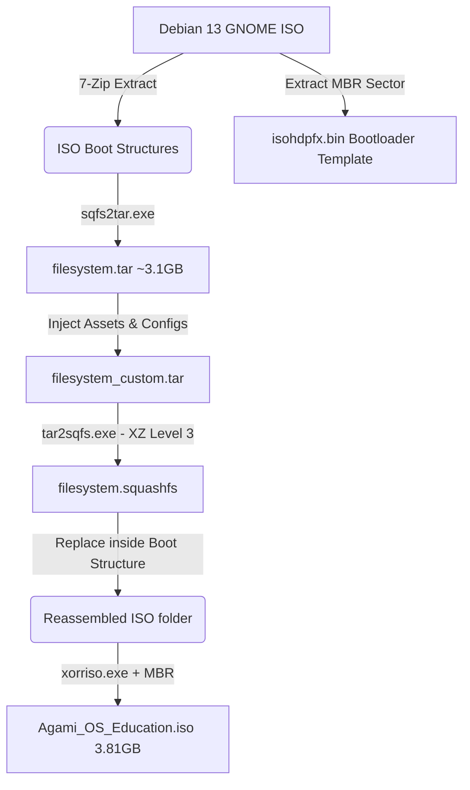

# <p align="center"></p>

<div align="center">

[](https://www.debian.org/)
[](https://www.gnome.org/)
[](https://www.linux.org/)
[](file:///C:/Users/softs/Documents/Agami_OS_Education/LICENSE)

<br/>

🌐 **Official Website:** [agami.softsasi.com](https://agami.softsasi.com)  
💾 **ISO Download Link:** [Download Agami OS Education](https://agami.softsasi.com/os/Agami_OS_Education.iso)

</div>

---

## 📜 Origin & Historical Journey

The visionary design and core architecture of this operating system have been under active development since the **middle of 2021**. The Softsasi team remains deeply committed to developing **Agami OS** — a robust, localized, and highly user-friendly operating system designed specifically for the needs of Bangladeshi schools, educators, and students.

*   **📅 Mid-2021 — The Spark**: Commenced intensive research, local usability studies, and driver-compatibility mapping to create a specialized, student-centric desktop environment.
*   **🚀 Q4 2022 — Version 1.0 Release**: Officially launched the first stable edition of Agami OS in the last quarter of 2022, establishing our footprint in school-accessible open-source computing.
*   **🔮 2026 & Beyond — Version 2.0 & Next**: Continually evolving Agami OS with state-of-the-art offline dashboards, system-wide autostart typing utilities, custom GRUB visual skins, and automated installer pipelines.

---

**Agami OS Education** is a premium, high-fidelity custom operating system engineered specifically for students, teachers, and schools. Designed and built by **[Softsasi](https://www.softsasi.com)**, it rides on a customized **Debian 13 (Trixie)** base paired with the modern **GNOME desktop environment**. 

It wraps cutting-edge offline learning software, interactive educational suites, and instant language tools in an elegant, glassmorphic visual wrapper that makes technology intuitive and engaging for learners worldwide.

This repository hosts our custom **build orchestration system** designed to deconstruct, customize, and repack bootable hybrid ISOs. The build system supports a native Linux terminal pipeline as well as an automated Windows command-line orchestrator that operates without requiring WSL, Hyper-V, or Docker.

---

## ⚡ Interactive Feature Highlights

<details open>
<summary><b>🎨 Glassmorphic Agami Education Hub (Offline Portal)</b></summary>
<br/>

The crown jewel of Version 2.0. A built-in offline educational dashboard featuring:
*   **Offline STEM Libraries**: Quick launcher shortcuts for Geography, Astronomy, Physics, and Chemistry simulation software.
*   **Offline Wikipedia / Reference**: Direct hookups to the Kiwix Desktop reader for completely network-independent knowledge retrieval.
*   **Bangla Typing Sandbox**: An offline sandbox with live word count diagnostics, complete with a graphic Phonetic layout reference guide.
*   **Interactive Design**: Crafted with a premium dark-slate glassmorphic teal theme, responsive cards, and dynamic hovering actions.

</details>

<details>
<summary><b>🇧🇩 Out-of-the-Box Bangla Phonetic Keyboard Integration</b></summary>
<br/>

No more complex layout troubleshooting for students:
*   **System Autostart Hook**: Custom initialization daemon (`/usr/local/bin/agami-init.sh`) runs instantly on GNOME login.
*   **Layout Registration**: Pre-registers English (`us`) and Bangla Phonetic (`ibus-m17n:bn:phonetic`) layouts, making them switchable instantly via `Super + Space`.
*   **GNOME Desktop Bar**: Anchors the standard layout switcher directly on the status pane for visual clarity.

</details>

<details>
<summary><b>💾 Persistent USB Storage Support</b></summary>
<br/>

Run directly from a USB stick without losing your work:
*   Includes detailed step-by-step Rufus & Ventoy guide inside the portal.
*   Explains exactly how to configure partition sliders to allow saving files, desktop customizations, and post-installed educational packages between reboots.

</details>

<details>
<summary><b>🖥️ Themed UEFI & Legacy BIOS Boot Splash Screens</b></summary>
<br/>

Professionalism from the very first second:
*   Standard Debian boot loaders are customized with a gorgeous glowing cybernetic emblem splash graphic.
*   Applies smoothly for both modern UEFI (`/boot/grub/splash.png`) and legacy BIOS (`/isolinux/splash.png`) configurations.

</details>

---

## 📂 Architecture & Build Layout

```
Agami_OS_Education/
├── .gitignore                   # Safe-excludes massive ISO/Tar build files
├── README.md                    # This gorgeous, interactive documentation
├── ROADMAP.md                   # Full package-by-package software install list
├── build_agami.py               # Main Windows-native build orchestration script
├── logo.png                     # Official Agami OS branding logo
├── wallpaper.png                # Custom 4K gradient desktop background
├── boot_splash.png              # Themed bootloader splash background image
├── agami_banner.svg             # Glowing, animated SVG banner for GitHub
├── tools/                       # Downloaded native Windows utilities (Git-ignored)
│   ├── tar2sqfs.exe             # High-speed SquasFS tar parser
│   ├── sqfs2tar.exe             # SquashFS unpacker
│   └── xorriso.exe              # Bootable hybrid ISO orchestrator
└── agami_hub/                   # Offline Agami Education Hub dashboard
    ├── index.html               # Main dashboard portal
    ├── style.css                # Slate-teal glassmorphic layout stylesheet
    └── script.js                # Sandbox logic & interactive transitions
```

---

## 🛠️ Windows-Native Build Pipeline

The system is constructed natively on Windows utilizing pre-compiled binaries to bypass POSIX barriers:



### Build Steps:
1. **Deconstruction**: The script automatically downloads SquashFS and `xorriso` toolsets, then parses the base Debian Live ISO using local `7-Zip`.
2. **Customization Injection**: 
   * Injects the **Agami Education Hub** into `/usr/share/agami-hub/`.
   * Overrides user templates `/etc/skel/` with shortcuts, autostarts, and system configurations.
   * Modifies GRUB and ISOLINUX splash assets.
3. **Recompression**: Compresses the customized root tree back to SquashFS utilizing maximum multi-threaded XZ compression.
4. **Mastering**: Compiles a hybrid ISO image bootable on both UEFI and legacy hardware.

---

## 🔮 Future Vision (Agami OS Version 3.0 & Beyond)

As we look toward the future of offline and accessible education, we plan to implement the following core upgrades in upcoming versions of Agami OS:

| Phase | Milestone | Description | Est. Timeline |
| :--- | :--- | :--- | :--- |
| **Phase 1** | **📦 100% Offline OER Pre-Caching** | Pre-bake full educational suites, Khan Academy offline content, and regional Wikipedia databases into the local SquashFS, removing the need for internet downloads. | *Q3 2026* |
| **Phase 2** | **🔌 Non-Free Driver Integration** | Out-of-the-box support for Broadcom, Realtek, and Intel Wi-Fi and Bluetooth drivers to ensure flawless performance on older school-provided laptops. | *Q4 2026* |
| **Phase 3** | **🤝 Agami Welcomer Assistant** | A beautiful, GUI setup wizard (GTK4) greeting students on first boot to easily choose languages, perform audio checks, and test screen readers. | *Q1 2027* |
| **Phase 4** | **🛡️ Classroom Sandbox & Controls** | Integrated profiles for schools allowing teachers to lock down systems to specific educational sandboxes and monitor student terminals. | *Q2 2027* |
| **Phase 5** | **🍷 Out-of-the-Box Windows Compatibility** | Pre-integrate Bottles / Wine tools to allow students to run Windows educational `.exe` / `.msi` software completely for free. | *Q2 2027* |
| **Phase 6** | **🪶 Ultra-Lightweight Spin** | A secondary XFCE or LXQt-based edition specifically optimized for obsolete computers with 1GB to 2GB of RAM. | *Q3 2027* |

---

### 🍷 Running Windows Software (Next Version Out-of-the-Box)

In the upcoming version of **Agami OS Education**, users will be able to run Windows educational tools and legacy software (`.exe`/`.msi` files) completely for free out-of-the-box via **Bottles** (a premium, user-friendly graphical runner for Wine).

If you want to use Windows software on the **current** version of Agami OS, you can easily set it up manually by following these three steps:

#### **Step 1: Install Flatpak**
Open your terminal and run the following command to install the Flatpak package manager:
```bash
sudo apt update && sudo apt install -y flatpak
```

#### **Step 2: Add Flathub Repository**
Add the Flathub repository to access Bottles and thousands of other Linux & Windows-compatible apps:
```bash
flatpak remote-add --if-not-exists flathub https://dl.flathub.org/repo/flathub.flatpakrepo
```

#### **Step 3: Install Bottles**
Finally, execute the following command to download and install Bottles:
```bash
flatpak install -y flathub com.usebottles.bottles
```

Once completed, search for **Bottles** in your GNOME application overview, open it, create a new gaming or software "Bottle" environment, and immediately run your Windows executables!

---

## 📋 Build Prerequisites

### Windows Build Requirements
*   **Operating System**: Windows 10 or 11 (64-bit).
*   **Python**: Version 3.10 or higher.
*   **7-Zip**: Installed at `C:\Program Files\7-Zip\` (used for ultra-fast deconstruction).
*   **Workspace Assets**: Ensure `logo.png`, `wallpaper.png`, and `boot_splash.png` are in the project root.

### Linux Build Requirements
To compile the custom ISO directly on standard Linux distributions (Debian, Ubuntu, Linux Mint, etc.):
*   **Operating System**: Debian 12 (Bookworm)+, Ubuntu 22.04 LTS+, or derivatives.
*   **Packages**: `squashfs-tools`, `xorriso`, `p7zip-full`, and `python3`.
*   **Installation Command**:
    ```bash
    sudo apt update && sudo apt install -y squashfs-tools xorriso p7zip-full python3
    ```

---

## ⚙️ Developer Guide: Compiling Agami OS

### Option A: Automated Build on Windows
1. Make sure `logo.png`, `wallpaper.png`, and `boot_splash.png` are in the root directory.
2. Open cmd or PowerShell in the project folder and run:
   ```powershell
   python build_agami.py
   ```
3. The script will set up the binary toolchain automatically and output `Agami_OS_Education.iso` in the root folder.

### Option B: Native Linux Build Pipeline (Linux-Native Shell)
If you are developing inside a Linux terminal environment, you can run these commands step-by-step to customize the image without running any Windows script:

1. **Extract Base ISO File**:
   ```bash
   7z x base.iso -oextracted_iso/
   ```
2. **Decompress Linux SquashFS Root Filesystem**:
   ```bash
   unsquashfs -d rootfs/ extracted_iso/live/filesystem.squashfs
   ```
3. **Inject Portals & System Overrides**:
   ```bash
   # Copy offline educational hub portal
   mkdir -p rootfs/usr/share/agami-hub/
   cp -r agami_hub/* rootfs/usr/share/agami-hub/
   
   # Copy wallpapers, launchers, and autostart init configs
   cp wallpaper.png rootfs/usr/share/backgrounds/agami_wallpaper.png
   cp logo.png rootfs/usr/share/pixmaps/agami-logo.png
   
   # Setup autostart configuration for live desktop
   cp build_files/agami-init.sh rootfs/usr/local/bin/agami-init.sh
   chmod +x rootfs/usr/local/bin/agami-init.sh
   cp build_files/agami-init.desktop rootfs/etc/xdg/autostart/agami-init.desktop
   
   # Setup desktop application launchers
   mkdir -p rootfs/etc/skel/Desktop/
   cp "build_files/Agami Education Hub.desktop" rootfs/etc/skel/Desktop/agami-hub.desktop
   cp "build_files/agami-install-software.desktop" rootfs/etc/skel/Desktop/agami-install-software.desktop
   cp "build_files/agami-install-software.sh" rootfs/usr/local/bin/agami-install-software.sh
   chmod +x rootfs/usr/local/bin/agami-install-software.sh
   
   # Override boot splash screens
   cp boot_splash.png extracted_iso/boot/grub/splash.png
   cp boot_splash.png extracted_iso/isolinux/splash.png
   ```
4. **Recompress SquashFS with High-Ratio XZ Compression**:
   ```bash
   rm extracted_iso/live/filesystem.squashfs
   mksquashfs rootfs/ extracted_iso/live/filesystem.squashfs -comp xz -b 1M
   ```
5. **Master UEFI & Legacy Hybrid Bootable ISO**:
   ```bash
   xorriso -as mkisofs \
     -iso-level 3 \
     -o Agami_OS_Education.iso \
     -full-iso9660-filenames \
     -volid "DEBIAN_LIVE" \
     -eltorito-boot isolinux/isolinux.bin \
     -eltorito-catalog isolinux/boot.cat \
     -no-emul-boot -boot-load-size 4 -boot-info-table \
     -isohybrid-mbr extracted_iso/isolinux/isohdpfx.bin \
     -eltorito-alt-boot \
     -e boot/grub/efi.img \
     -no-emul-boot -isohybrid-gpt-basdat \
     extracted_iso/
   ```

---

## 🛠️ Version 2.0 Engineering Customization Walkthrough

To ensure we can easily maintain and upgrade the custom OS in the future, here is the detailed technical breakdown of the exact customizations designed and integrated into **Agami OS Education Version 2.0**:

### 1. Keyboard & Desktop Initialization Script
*   **Script Location**: `/usr/local/bin/agami-init.sh`
*   **Trigger Mechanism**: System-wide autostart launcher placed at `/etc/xdg/autostart/agami-init.desktop` which executes automatically upon user login.
*   **Rationale**: Live GNOME systems ignore standard pre-boot system-wide input overrides. To solve this, `agami-init.sh` runs as a post-login user agent to:
    1. Register English (`us`) and Bangla Phonetic (`ibus` via `m17n:bn:phonetic`) out-of-the-box keyboard input sources.
    2. Activate the language indicator dropdown in the top GNOME status panel.
    3. Dynamically set our custom 4K system wallpaper for both light and dark GNOME layouts.
*   **Core Commands**:
    ```bash
    # Registers US XKB and Bangla Phonetic m17n layouts
    gsettings set org.gnome.desktop.input-sources sources "[('xkb', 'us'), ('ibus', 'm17n:bn:phonetic')]"
    
    # Enables the GNOME input switcher visible status bar
    gsettings set org.gnome.desktop.input-sources show-all-sources true
    ```

### 2. Glassmorphic Agami Education Hub
*   **Installation Directory**: `/usr/share/agami-hub/`
*   **Access shortcuts**: Programmed into `/etc/skel/Desktop/agami-hub.desktop` so that every live session user receives a launcher icon directly on their desktop.
*   **Integrated Modules**:
    *   **STEM Simulators**: Quick action buttons launching local Geography, Astronomy, Physics, and Chemistry tools.
    *   **Phonetic Typing Sandbox**: A locally-rendered typing simulator with active character count diagnostics and graphic layout charts for learning Bangla phonetic inputs.
    *   **USB Persistence**: A complete, step-by-step Rufus and Ventoy tutorial explaining how to allocate persistent volume partition sliders.

### 3. Custom UEFI & Legacy BIOS Boot Splash Screens
*   **Target Files**: UEFI GRUB splash (`/boot/grub/splash.png`) and Legacy BIOS splash (`/isolinux/splash.png`).
*   **Action**: The Python build orchestrator automatically copies our high-resolution glowing cybernetic theme banner directly into these paths, replacing the default Debian splash images for branded aesthetics from the first second of booting.

### 4. Educational Software Installer Pipeline
*   **Desktop Shortcut**: `/etc/skel/Desktop/agami-install-software.desktop` pointing to the script `/usr/local/bin/agami-install-software.sh`.
*   **Objective**: Pre-caching massive flatpaks and apps inside the raw live filesystem causes high image size inflation. This script allows users with active internet to easily:
    1. Retrieve and configure Brave Browser secure apt keys.
    2. Install the complete LibreOffice suite (with Bangla localization/help files), Kiwix Desktop, GCompris Qt learning center, Tuxmath, Scratch, GeoGebra, and physics/chemistry simulators.
    3. Automatically run system cleanups and autoremoves to prevent storage build-up on the persistent partition.

---

## 👥 Core Development Team

**Agami OS Education** is proudly engineered, researched, and coordinated by:

*   **Shakil Anower Samrat** — *Chief Executive Officer*
*   **Izaz Uddin Mahmud** — *Researcher*
*   **Sumaiya Fatima Nahin** — *Project Manager*
*   **Lian Mollick** — *Embedded Engineer and UX Designer*

---

**Agami OS Education** is developed and supported by **Softsasi** ([www.softsasi.com](https://www.softsasi.com)). 
For educational sponsorships, school rollouts, or technical support, reach out to us at [support@agami.softsasi.com](mailto:support@agami.softsasi.com).
