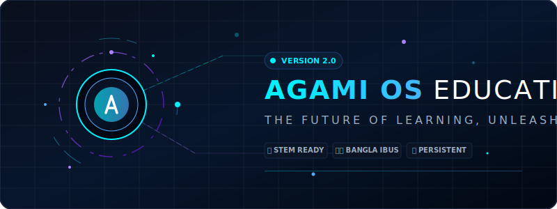
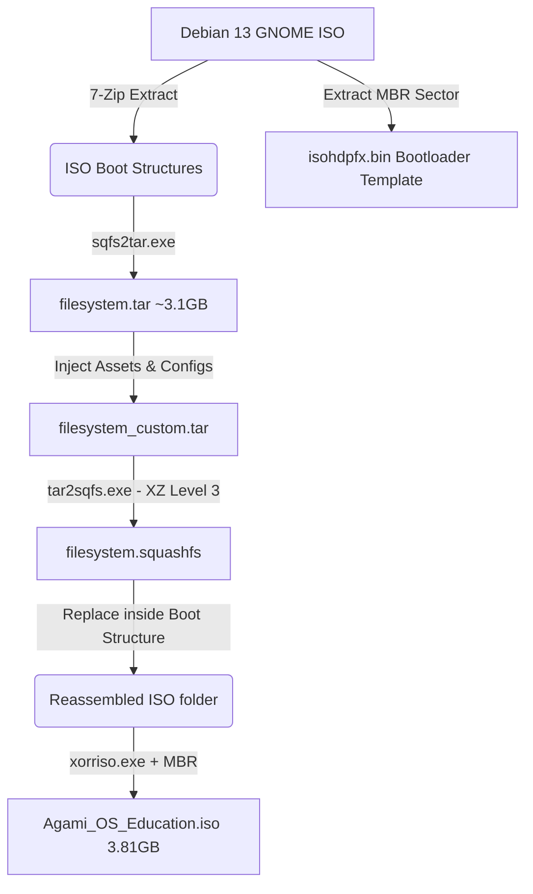

# <p align="center"></p>

<div align="center">

[](https://www.debian.org/)
[](https://www.gnome.org/)
[](https://microsoft.com/)
[](https://gnu.org/licenses/gpl.html)

</div>

---

**Agami OS Education** is a premium, high-fidelity custom operating system engineered specifically for students, teachers, and schools. Designed and built by **[Softsasi](https://www.softsasi.com)**, it rides on a customized **Debian 13 (Trixie)** base paired with the modern **GNOME desktop environment**. 

It wraps cutting-edge offline learning software, interactive educational suites, and instant language tools in an elegant, glassmorphic visual wrapper that makes technology intuitive and engaging for learners worldwide.

This repository hosts our custom **Windows-native build orchestration system** that extracts, customizes, and repacks bootable hybrid ISOs directly in standard Windows command line environments without demanding WSL, Hyper-V, or Docker.

---

## ⚡ Interactive Feature Highlights

<details open>
<summary><b>🎨 Glassmorphic Agami Education Hub (Offline Portal)</b></summary>
<br/>

The crown jewel of Version 2.0. A built-in offline educational dashboard featuring:
*   **Offline STEM Libraries**: Quick launcher shortcuts for Geography, Astronomy, Physics, and Chemistry simulation software.
*   **Offline Wikipedia / Reference**: Direct hookups to the Kiwix Desktop reader for completely network-independent knowledge retrieval.
*   **Bangla Typing Sandbox**: An offline sandbox with live word count diagnostics, complete with a graphic Phonetic layout reference guide.
*   **Interactive Design**: Crafted with a premium dark-slate glassmorphic teal theme, responsive cards, and dynamic hovering actions.

</details>

<details>
<summary><b>🇧🇩 Out-of-the-Box Bangla Phonetic Keyboard Integration</b></summary>
<br/>

No more complex layout troubleshooting for students:
*   **System Autostart Hook**: Custom initialization daemon (`/usr/local/bin/agami-init.sh`) runs instantly on GNOME login.
*   **Layout Registration**: Pre-registers English (`us`) and Bangla Phonetic (`ibus-m17n:bn:phonetic`) layouts, making them switchable instantly via `Super + Space`.
*   **GNOME Desktop Bar**: Anchors the standard layout switcher directly on the status pane for visual clarity.

</details>

<details>
<summary><b>💾 Persistent USB Storage Support</b></summary>
<br/>

Run directly from a USB stick without losing your work:
*   Includes detailed step-by-step Rufus & Ventoy guide inside the portal.
*   Explains exactly how to configure partition sliders to allow saving files, desktop customizations, and post-installed educational packages between reboots.

</details>

<details>
<summary><b>🖥️ Themed UEFI & Legacy BIOS Boot Splash Screens</b></summary>
<br/>

Professionalism from the very first second:
*   Standard Debian boot loaders are customized with a gorgeous glowing cybernetic emblem splash graphic.
*   Applies smoothly for both modern UEFI (`/boot/grub/splash.png`) and legacy BIOS (`/isolinux/splash.png`) configurations.

</details>

---

## 📂 Architecture & Build Layout

```
Agami_OS_Education/
├── .gitignore                   # Safe-excludes massive ISO/Tar build files
├── README.md                    # This gorgeous, interactive documentation
├── ROADMAP.md                   # Full package-by-package software install list
├── build_agami.py               # Main Windows-native build orchestration script
├── logo.png                     # Official Agami OS branding logo
├── wallpaper.png                # Custom 4K gradient desktop background
├── boot_splash.png              # Themed bootloader splash background image
├── agami_banner.svg             # Glowing, animated SVG banner for GitHub
├── tools/                       # Downloaded native Windows utilities (Git-ignored)
│   ├── tar2sqfs.exe             # High-speed SquasFS tar parser
│   ├── sqfs2tar.exe             # SquashFS unpacker
│   └── xorriso.exe              # Bootable hybrid ISO orchestrator
└── agami_hub/                   # Offline Agami Education Hub dashboard
    ├── index.html               # Main dashboard portal
    ├── style.css                # Slate-teal glassmorphic layout stylesheet
    └── script.js                # Sandbox logic & interactive transitions
```

---

## 🛠️ Windows-Native Build Pipeline

The system is constructed natively on Windows utilizing pre-compiled binaries to bypass POSIX barriers:



### Build Steps:
1. **Deconstruction**: The script automatically downloads SquashFS and `xorriso` toolsets, then parses the base Debian Live ISO using local `7-Zip`.
2. **Customization Injection**: 
   * Injects the **Agami Education Hub** into `/usr/share/agami-hub/`.
   * Overrides user templates `/etc/skel/` with shortcuts, autostarts, and system configurations.
   * Modifies GRUB and ISOLINUX splash assets.
3. **Recompression**: Compresses the customized root tree back to SquashFS utilizing maximum multi-threaded XZ compression.
4. **Mastering**: Compiles a hybrid ISO image bootable on both UEFI and legacy hardware.

---

## 🔮 Future Vision (Agami OS Version 3.0 & Beyond)

As we look toward the future of offline and accessible education, we plan to implement the following core upgrades in upcoming versions of Agami OS:

| Phase | Milestone | Description | Est. Timeline |
| :--- | :--- | :--- | :--- |
| **Phase 1** | **📦 100% Offline OER Pre-Caching** | Pre-bake full educational suites, Khan Academy offline content, and regional Wikipedia databases into the local SquashFS, removing the need for internet downloads. | *Q3 2026* |
| **Phase 2** | **🔌 Non-Free Driver Integration** | Out-of-the-box support for Broadcom, Realtek, and Intel Wi-Fi and Bluetooth drivers to ensure flawless performance on older school-provided laptops. | *Q4 2026* |
| **Phase 3** | **🤝 Agami Welcomer Assistant** | A beautiful, GUI setup wizard (GTK4) greeting students on first boot to easily choose languages, perform audio checks, and test screen readers. | *Q1 2027* |
| **Phase 4** | **🛡️ Classroom Sandbox & Controls** | Integrated profiles for schools allowing teachers to lock down systems to specific educational sandboxes and monitor student terminals. | *Q2 2027* |
| **Phase 5** | **🍷 Out-of-the-Box Windows Compatibility** | Pre-integrate Bottles / Wine tools to allow students to run Windows educational `.exe` / `.msi` software completely for free. | *Q2 2027* |
| **Phase 6** | **🪶 Ultra-Lightweight Spin** | A secondary XFCE or LXQt-based edition specifically optimized for obsolete computers with 1GB to 2GB of RAM. | *Q3 2027* |

---

### 🍷 Running Windows Software (Next Version Out-of-the-Box)

In the upcoming version of **Agami OS Education**, users will be able to run Windows educational tools and legacy software (`.exe`/`.msi` files) completely for free out-of-the-box via **Bottles** (a premium, user-friendly graphical runner for Wine).

If you want to use Windows software on the **current** version of Agami OS, you can easily set it up manually by following these three steps:

#### **Step 1: Install Flatpak**
Open your terminal and run the following command to install the Flatpak package manager:
```bash
sudo apt update && sudo apt install -y flatpak
```

#### **Step 2: Add Flathub Repository**
Add the Flathub repository to access Bottles and thousands of other Linux & Windows-compatible apps:
```bash
flatpak remote-add --if-not-exists flathub https://dl.flathub.org/repo/flathub.flatpakrepo
```

#### **Step 3: Install Bottles**
Finally, execute the following command to download and install Bottles:
```bash
flatpak install -y flathub com.usebottles.bottles
```

Once completed, search for **Bottles** in your GNOME application overview, open it, create a new gaming or software "Bottle" environment, and immediately run your Windows executables!

---

## 📋 Build Prerequisites

To compile the ISO locally from your Windows machine:
* **Operating System**: Windows 10 or 11 (64-bit).
* **Python**: Version 3.10 or higher.
* **7-Zip**: Installed at `C:\Program Files\7-Zip\` (used for ultra-fast deconstruction).
* **Workspace Assets**: Make sure `logo.png`, `wallpaper.png`, and `boot_splash.png` are in the project root.

---

## ⚙️ Developer Guide: Compile Now

1. Place your configuration assets in the repository root.
2. Launch terminal or PowerShell in the project directory.
3. Trigger the Python builder:
   ```powershell
   python build_agami.py
   ```
4. The script will automatically assemble all folders and output `Agami_OS_Education.iso` directly in the project directory.

---
**Agami OS Education** is developed and supported by **Softsasi** ([www.softsasi.com](https://www.softsasi.com)). 
For educational sponsorships, school rollouts, or technical support, reach out to us at [support@agami.softsasi.com](mailto:support@agami.softsasi.com).
